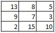

# Face Recognition Quiz

## Haar Cascade
1. Haar cascade is an algorithm that used to identify object in an image or video. What is the limitation of this algorithm?
  - [ ] couldn't be able to recognize partially covered faces 
  - [ ] complexity in computation
  - [ ] requires dozens of experiments.

2. Which one the statement below is TRUE about adaptive boosting?
  - [ ] The main idea of adaptive boosting is used to boost the classification performance of a simple or         weak classifier to minimize the error rate.
  - [ ] The main idea of adaptive boosting is used to boost the classification performance of a simple or         weak classifier to maximize the error rate.
  - [ ] The main idea of adaptive boosting is used to boost the classification performance from strong           classifier to minimize the error rate
  

3. What does the Haar algorithm do in Integral images process?
  - [ ] convert input image into integral image and then define the features by adding the sum of pixels         under a bright rectangle and the sum of pixels under the dark rectangle
  - [ ] convert input image into integral image and then define the features by substract the sum of             pixels under a bright rectangle from the sum of pixels under the dark rectangle
  - [ ] substract the sum of pixels under a bright rectangle from the sum of pixels under the dark               rectangle in the inputed image
  

## Local Binary Pattern Histogram (LBPH)
4. When performing face recognition, algorithm will return confidence measurement value. what does actually the confidence is?
  - [ ] the distance between the center point pixel and the neighboring pixel
  - [ ] the distance between each features in training data
  - [ ] the distance between histogram training data and histrogram test data
  - [ ] there is no right answer

5. Given the 3x3 matrix below :
	

	
	find the binary value and then convert into decimal value to calculate new central value. What is the   result?
	- [ ] 189
	- [ ] 179
	- [ ] 169
	- [ ] 168

6. By rescaling the input image, we can resize a larger face into the smaller one and making it detectable by the algorithm. Say I want to resize my image by 6%, what does the correct parameter for the code?
 - [ ] detectMultiScale(gray_img,scaleFactor=0.06,minNeighbors=0.06)
 - [ ] detectMultiScale(gray_img,scaleFactor=2.06,minNeighbors=1.06)
 - [ ] detectMultiScale(gray_img,scaleFactor=0.06,minNeighbors=5)
 - [ ] detectMultiScale(gray_img,scaleFactor=1.06,minNeighbors=5)
 

